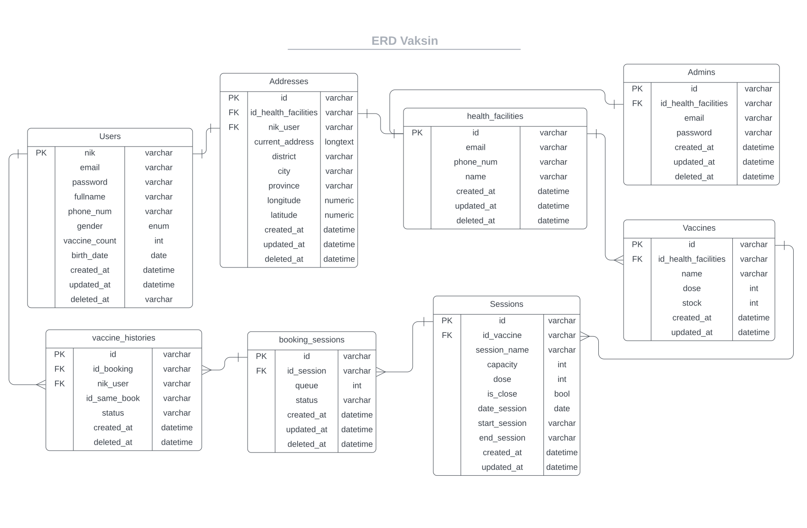

:sparkles:Alterra Project:sparkles:

<h1 align="center">VAKSIN.ID</h1>

## Preview
| Admin | User |
| ----------- | ----------- |
| |  |

## 🚩 MVP
| Admin | User |
| ----------- | ----------- |
| <ul><li>- [x] Register to the system using NIK</li>| <ul><li>- [x] Manage vaccination bookings</li> |
| <ul><li>- [x] Add their family members</li>| <ul><li>- [x] Manage sessions availability</li> |
| <ul><li>- [x] Book vaccination sessions in nearby health facilities</li>| <ul><li>- [x] Manage vaccine stocks</li> |
| <ul><li>- [x] Receive a vaccination pass to be shown in health facilities</li>| <ul><li>- [x] Vaccination Names</li> |
| <ul><li>- [x] Find nearby health facilities </li>| <ul><li>- [x] Manage User Register</li> |

## 🎨 Design
* ERD 

* Usecase Diagram 
  
## 📑 Backend Documentation
* [Swagger](https://app.swaggerhub.com/apis-docs/MAULANAGALIH3496_1/VAKSIN.ID/1.0.2)
* [Postman](https://documenter.getpostman.com/view/19210761/2s8YzWT26m)
