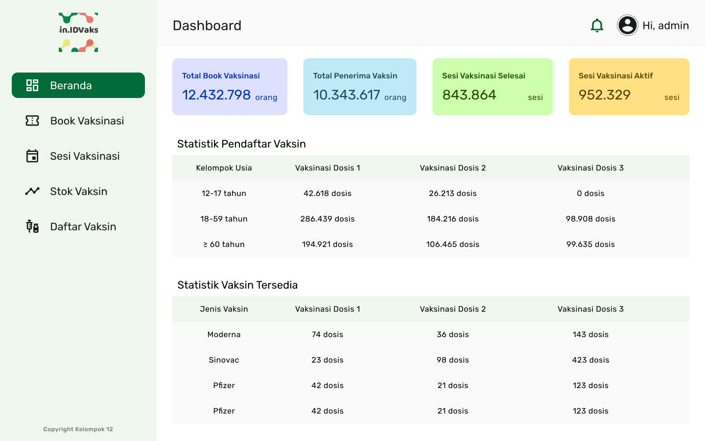
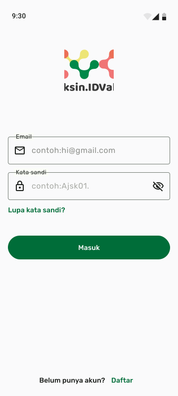
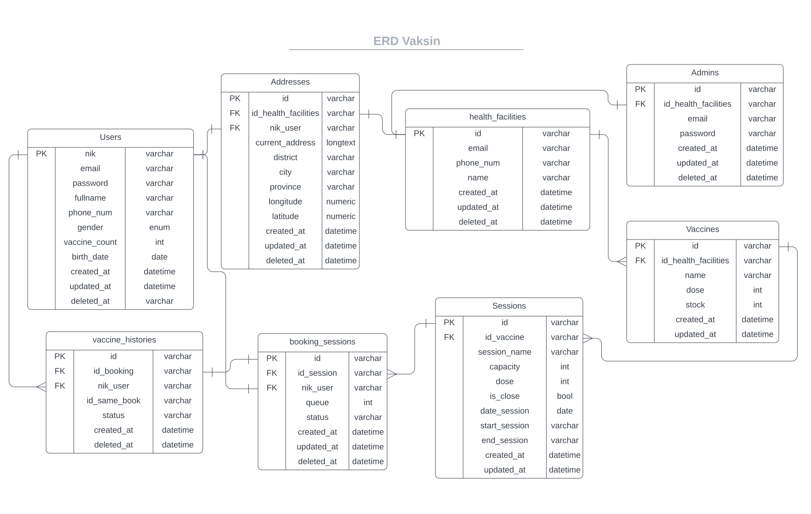
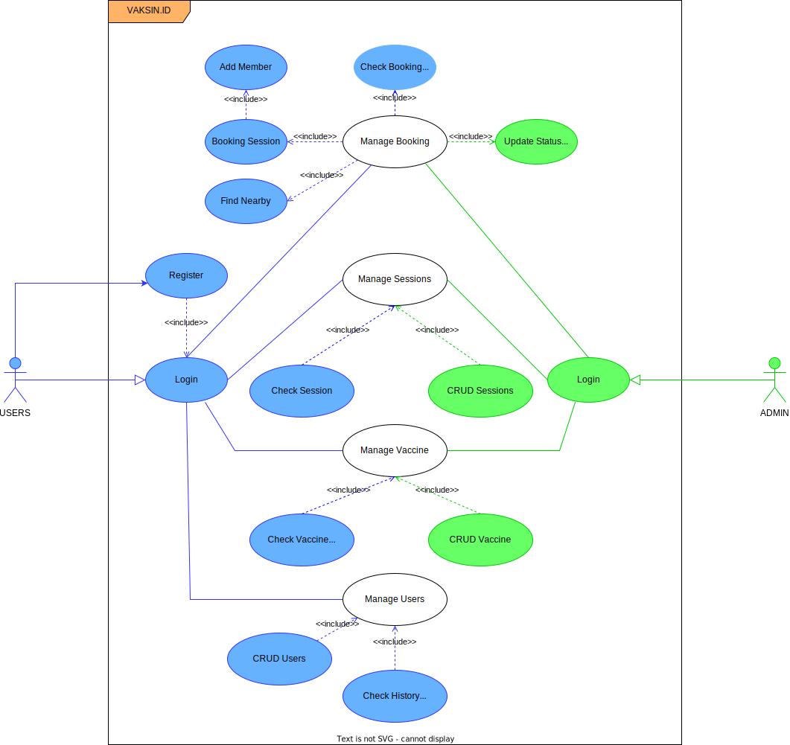

:sparkles:Alterra Project:sparkles:

<h1 align="center">VAKSIN.ID</h1>

## Preview
| Admin | User |
| ----------- | ----------- |
| |  |

## 🎯 Project Goal
The goal of the project is to help the government’s goal of Covid-19 vaccinations by facilitating users to book vaccination sessions easily and creating a proper system for health facilities.

## 🚩 MVP
| User  | Admin |
| ----------- | ----------- |
| <ul><li>- [x] Register to the system using NIK</li>| <ul><li>- [x] Manage vaccination bookings</li> |
| <ul><li>- [x] Add their family members</li>| <ul><li>- [x] Manage sessions availability</li> |
| <ul><li>- [x] Book vaccination sessions in nearby health facilities</li>| <ul><li>- [x] Manage vaccine stocks</li> |
| <ul><li>- [x] Receive a vaccination pass to be shown in health facilities</li>| <ul><li>- [x] Vaccination Names</li> |
| <ul><li>- [x] Find nearby health facilities </li>| <ul><li>- [x] Manage User Register</li> |

## 🎨 Design
* ERD 

* Usecase Diagram 

## 💻 Rest API Design

## 📑 Backend Documentation
* [Swagger](https://vaksin-y3awbiupna-as.a.run.app/swagger/index.html#/)
* [Postman](https://documenter.getpostman.com/view/19210761/2s8YzWT26m)
